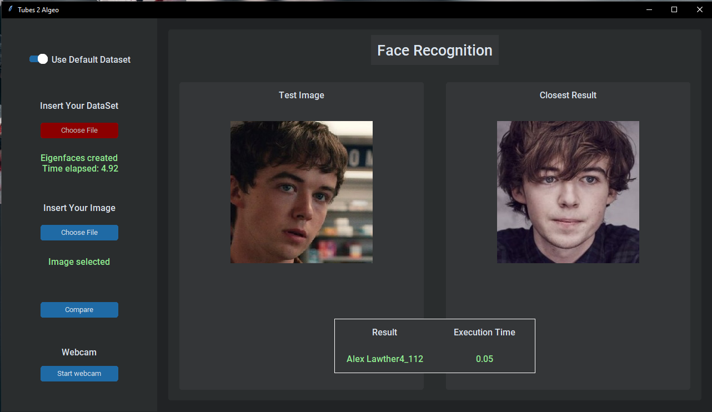
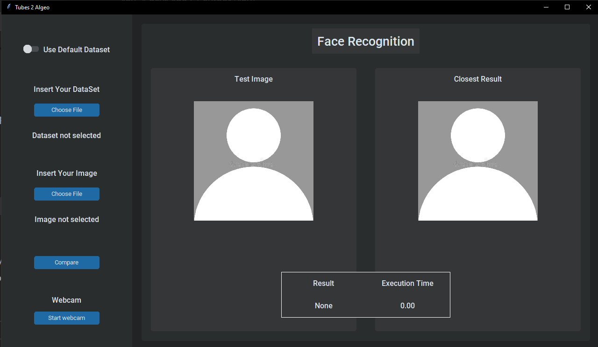

# Algeo02-21110

Kelompok 22 NNN:

- [13521110 Yanuar Sano Nur Rasyid](https://github.com/yansans)
- [13521121 Saddam Annais Shaquille](https://github.com/SaddamAnnais)
- [13521150 I Putu Bakta Hari Sudewa](https://github.com/sozyGithub)

## Tugas Besar Algeo 2 - Eigenface

> Program _face recognition_ terhadap masukan gambar oleh user atau webcam berdasarkan dataset _default_ atau dataset masukan user.

## Table of Contents

- [Algeo02-21110](#algeo02-21110)
  - [Tugas Besar Algeo 2 - Eigenface](#tugas-besar-algeo-2---eigenface)
  - [Table of Contents](#table-of-contents)
  - [Setup](#setup)
  - [Usage](#usage)
  - [General Information](#general-information)
  - [Teknologi yang digunakan](#teknologi-yang-digunakan)
  - [Fitur](#fitur)
  - [Screenshots](#screenshots)
  - [Project Status](#project-status)
  - [Room for Improvement](#room-for-improvement)
  <!-- * [License](#license) -->

## Setup

Program membutuhkan beberapa library python yaitu:

- OpenCV
- Numpy
- Mediapipe
- PIL
- tkinter
- customtkinter

Semua library di atas dapat diinstall menggunakan pip

## Usage

Cara memulai aplikasi

1. Clone repository menggunakan command

   ```bash
    git clone https://github.com/SaddamAnnais/Algeo02-21110.git
   ```

2. Masuk ke folder utama dan jalankan main.py dari folder src

   ```bash
    cd Algeo02-21110
    python ./src/main.py

   ```

3. Masukan folder dataset atau gunakan default dataset, masukan gambar yang akan dibandingkan, kemudian klik compare



## General Information

Tugas Besar 2 ini merupakan implementasi konsep Mata Kuliah Aljabar Linier dan Geometri untuk membuat sebuah program pengenalan wajah (Face Recognition).  
Program pengenalan wajah melibatkan kumpulan citra wajah yang sudah disimpan pada database lalu berdasarkan kumpulan citra wajah tersebut, program dapat mempelajari bentuk wajah lalu mencocokkan antara kumpulan citra wajah yang sudah dipelajari dengan citra yang akan diidentifikasi.

## Teknologi yang digunakan

- python
- OpenCV
- Numpy
- Mediapipe
- PIL
- tkinter
- customtkinter

## Fitur

- Memasukkan folder gambar sebagai dataset yang akan digunakan
- Memasukan gambar dan membandingkannya dengan dataset
- Menggunakan webcam sebagai input gambar untuk dibandingkan

## Screenshots



<!-- If you have screenshots you'd like to share, include them here. -->

## Project Status

Project is: _complete_

## Room for Improvement

Room for improvement:

- Menggunakan gambar RGB bukan _greyscale_
- Menambahkan fitur machine learning

<!-- Optional -->
<!-- ## License -->
<!-- This project is open source and available under the [... License](). -->

<!-- You don't have to include all sections - just the one's relevant to your project -->
